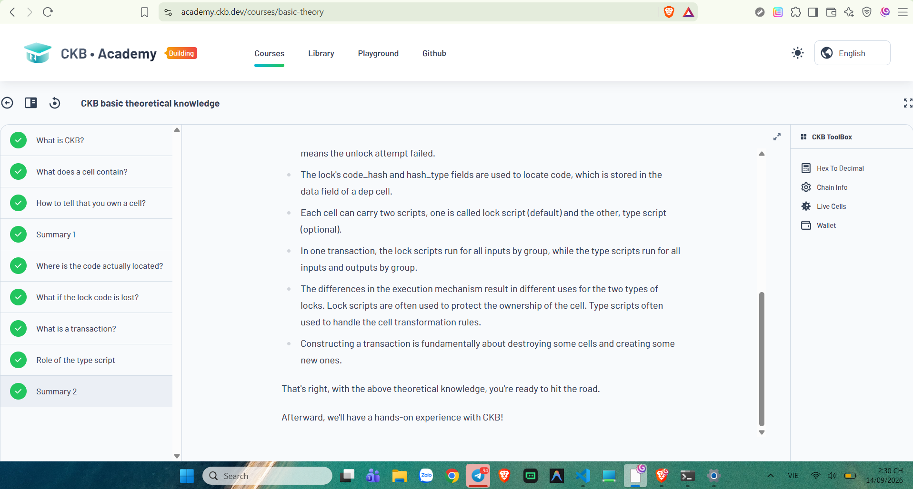
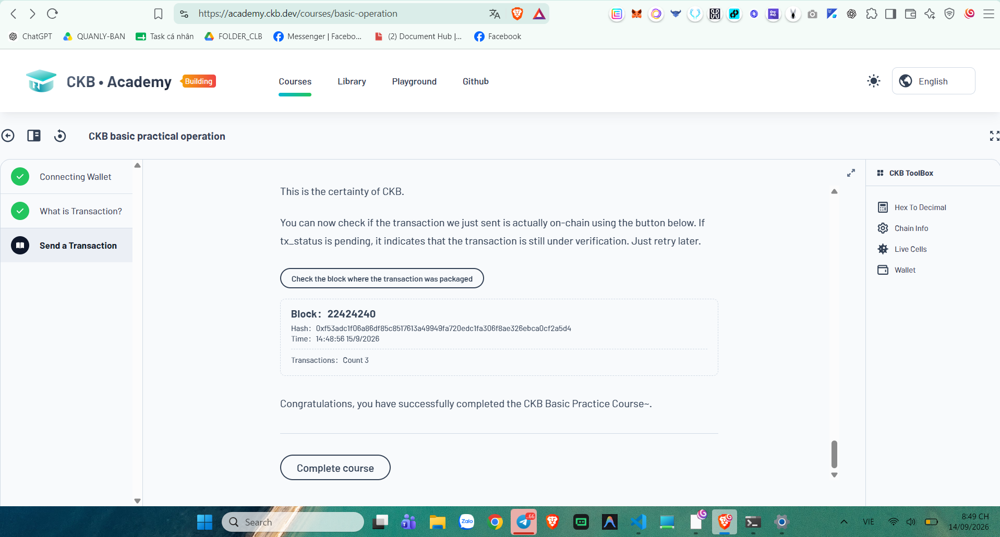
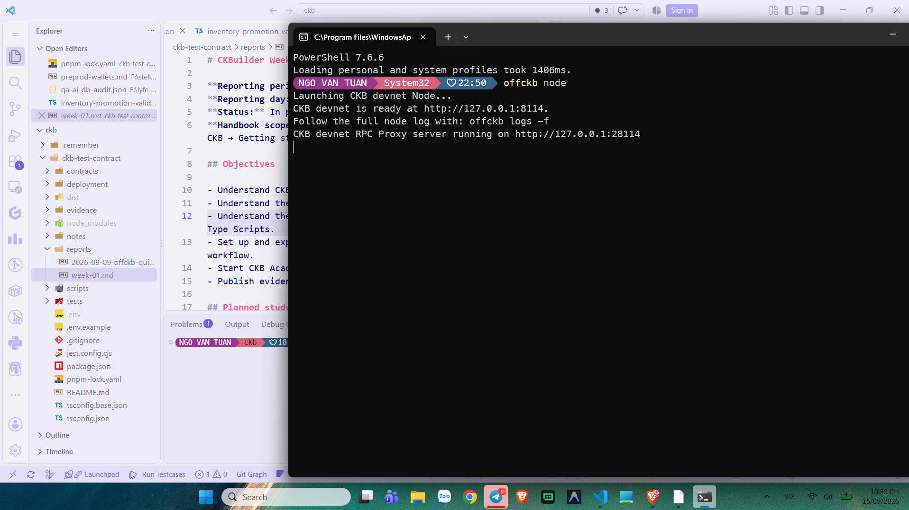
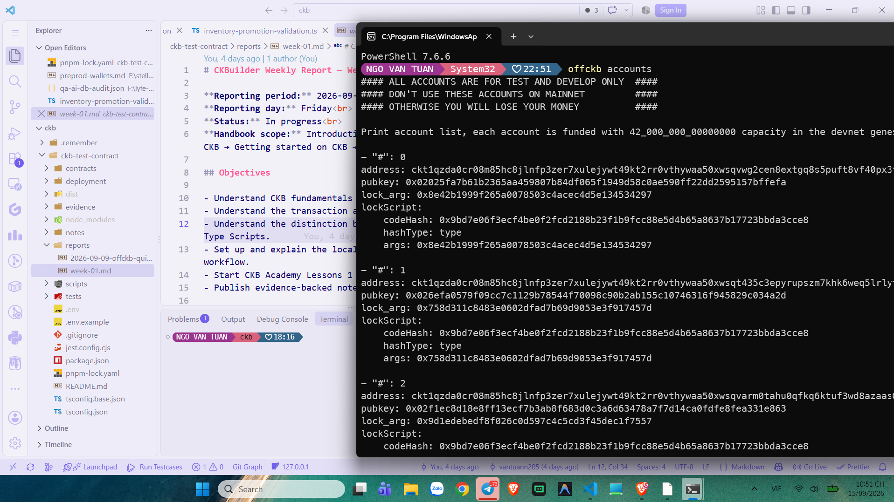
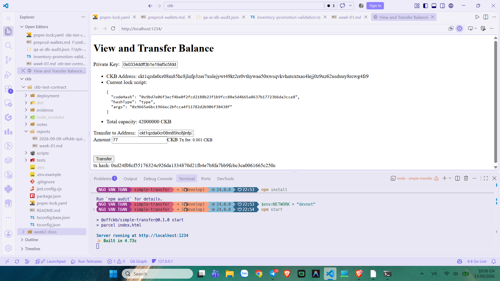
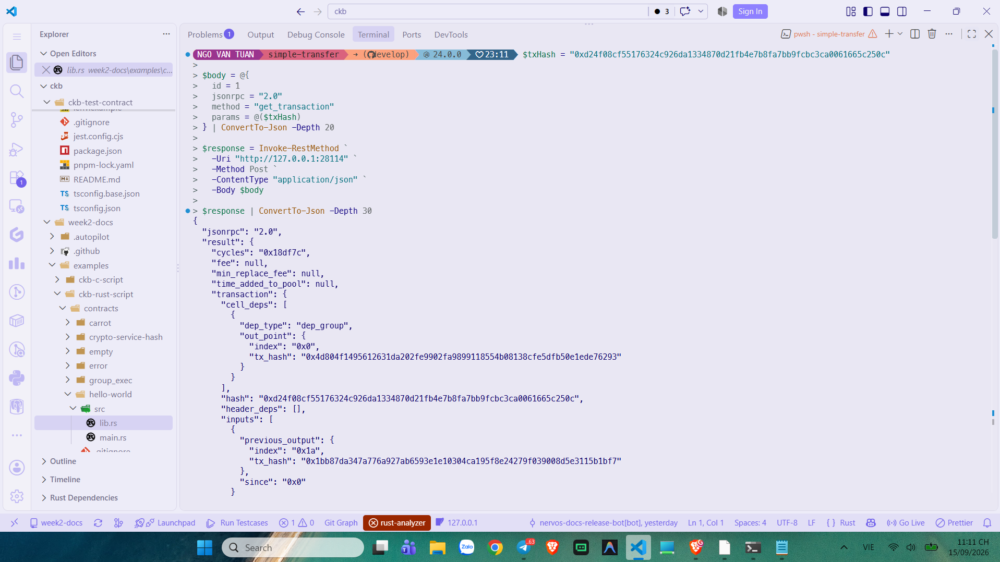
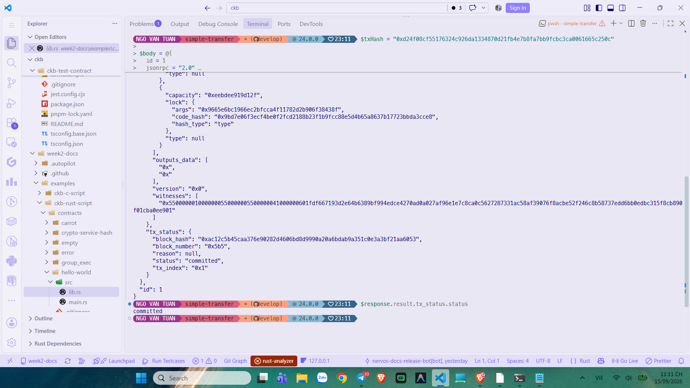
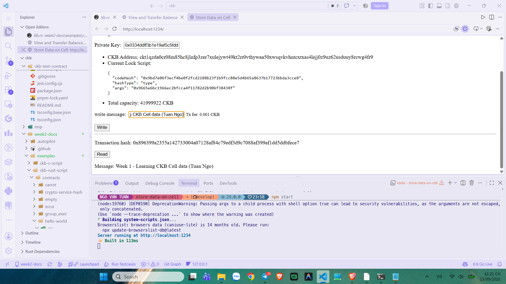
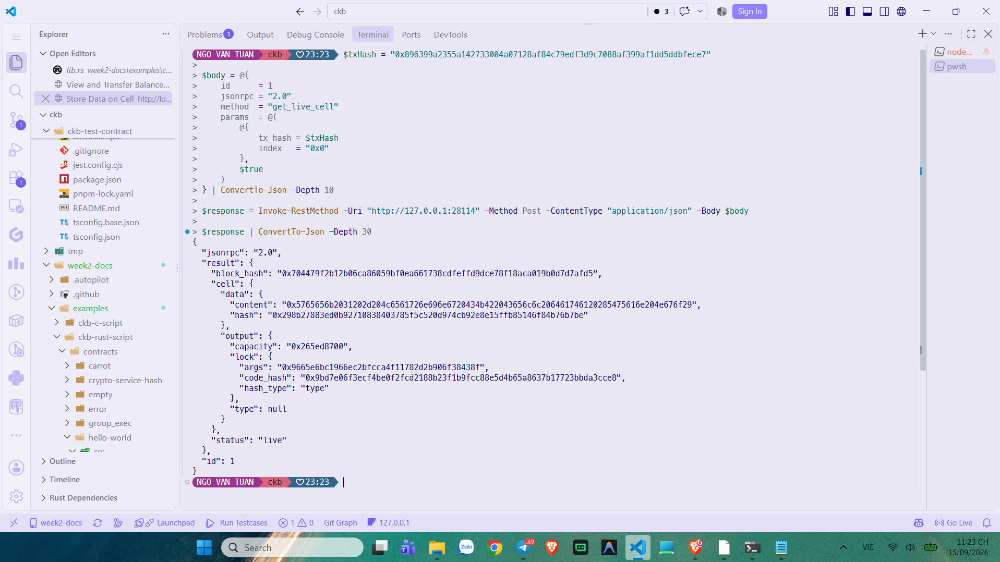
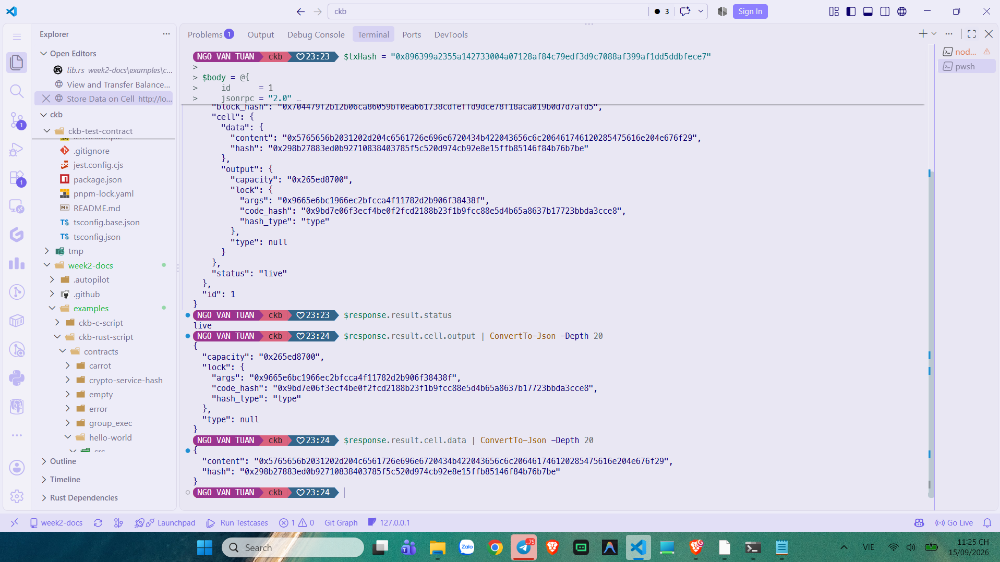

# CKBuilder Weekly Report — Week 1

**Author:** Tuan Ngo<br>
**Reporting period:** 9–15 September 2026<br>
**Status:** Completed<br>
**Scope:** CKB fundamentals, the Cell Model, transactions, scripts, OffCKB, JSON-RPC, and introductory dApp exercises

## Overview

This report combines my onboarding work and first two study blocks into the first CKBuilder weekly submission. I completed the CKB Academy theory and practical courses, ran a local CKB Devnet with OffCKB, transferred CKB between development accounts, and stored a short message in a Cell. I then checked both transactions directly through the Devnet RPC proxy instead of relying only on the browser interface.

The practical work made the Cell Model much clearer. A transfer does not update an account balance in place. It consumes existing Cells and creates new output Cells. The same model also allows arbitrary data to be carried in a Cell, while scripts define who can consume it and which state transitions are valid.

## Learning completed

### CKB fundamentals and the Cell Model

CKB represents state through Cells. A Cell contains capacity, a mandatory lock script, an optional type script, and a data field. A live Cell is an unspent output that can be used as a future transaction input. Once consumed, that Cell becomes dead and cannot be used again; the transaction creates new Cells to represent the next state.

I completed the CKB Academy basic theory material covering Cell ownership, script location, transactions, and the different responsibilities of lock and type scripts.



*Figure 1. Completed modules in the CKB basic theoretical knowledge course.*

### Transactions and Cell lifecycle

A valid CKB transaction references live Cells as inputs and creates new Cells as outputs. Input Cells are consumed atomically. The total output capacity plus the transaction fee cannot exceed the input capacity, and all applicable scripts must pass before the state transition is accepted.

The Academy practical course demonstrated this lifecycle by constructing and sending a transaction, waiting for it to be packaged, and locating the committed transaction in a block.



*Figure 2. Completion of the CKB basic practical operation course and transaction confirmation exercise.*

### Lock Scripts and Type Scripts

A lock script controls the right to consume a Cell. In the standard development account flow, a valid signature proves that the transaction was authorized by the holder of the corresponding key. A type script serves a different purpose: it validates the creation, update, or destruction rules for a group of Cells. This makes lock scripts suitable for ownership and type scripts suitable for asset or state-transition rules.

The development accounts used the standard Devnet lock code:

```json
{
  "codeHash": "0x9bd7e06f3ecf4be0f2fcd2188b23f1b9fcc88e5d4b65a8637b17723bbda3cce8",
  "hashType": "type"
}
```

## Local development environment

I started the local chain with `offckb node`. The CKB node listened on `http://127.0.0.1:8114`, while OffCKB exposed its RPC proxy on `http://127.0.0.1:28114`.



*Figure 3. Local CKB Devnet and RPC proxy running through OffCKB.*

I also inspected the funded development accounts with `offckb accounts`. These accounts belong only to the local Devnet. Private keys are intentionally excluded from this repository.



*Figure 4. OffCKB development account output, including addresses and lock-script information.*

The two accounts used in the exercises were:

| Role | Account | Devnet address | Lock args |
| --- | ---: | --- | --- |
| Sender and data owner | 4 | `ckt1qzda0cr08m85hc8jlnfp3zer7xulejywt49kt2rr0vthywaa50xwsqvkvhntcxtxas4lejj0z9uz62usduuy8rcwg4fr9` | `0x9665e6bc1966ec2bfcca4f11782d2b906f38438f` |
| Transfer recipient | 5 | `ckt1qzda0cr08m85hc8jlnfp3zer7xulejywt49kt2rr0vthywaa50xwsqgdl92j7574rgmc4w3x00y93kk6g3lggqq23mmmd` | `0x0df9552f53d51a378aba267bc858dada447e8400` |

## Practical exercise 1 — Transfer CKB

I ran the simple-transfer example against the local Devnet and transferred **77 CKB** from account 4 to account 5 with a displayed fee of **0.001 CKB**.

**Transaction hash:** `0xd24f08cf55176324c926da1334870d21fb4e7b8fa7bb9fcbc3ca0061665c250c`



*Figure 5. The transfer dApp showing the amount, recipient, local server, and resulting transaction hash.*

I queried the transaction through JSON-RPC using `get_transaction`. The response exposed the transaction inputs, outputs, Cell dependencies, witnesses, execution cycles, and transaction status.

```powershell
$txHash = "0xd24f08cf55176324c926da1334870d21fb4e7b8fa7bb9fcbc3ca0061665c250c"

$body = @{
    id      = 1
    jsonrpc = "2.0"
    method  = "get_transaction"
    params  = @($txHash)
} | ConvertTo-Json -Depth 20

$response = Invoke-RestMethod -Uri "http://127.0.0.1:28114" -Method Post -ContentType "application/json" -Body $body
$response | ConvertTo-Json -Depth 30
```



*Figure 6. Full JSON-RPC transaction response for the 77 CKB transfer.*

The final status was `committed`, confirming that the transaction had been included in a Devnet block rather than remaining only in the transaction pool.



*Figure 7. Direct verification of the transfer transaction's committed status.*

## Practical exercise 2 — Store data in a Cell

The second dApp created a Cell containing the UTF-8 message:

```text
Week 1 - Learning CKB Cell data (Tuan Ngo)
```

The transaction used account 4, displayed a fee of **0.001 CKB**, and returned the same message when I selected **Read**.

**Transaction hash:** `0x896399a2355a142733004a07128af84c79edf3d9c7088af399af1dd5ddbfece7`



*Figure 8. The Store Data on Cell example after writing and reading the message.*

I used `get_live_cell` with `with_data` set to `true` to confirm the output independently:

```powershell
$txHash = "0x896399a2355a142733004a07128af84c79edf3d9c7088af399af1dd5ddbfece7"

$body = @{
    id      = 1
    jsonrpc = "2.0"
    method  = "get_live_cell"
    params  = @(
        @{ tx_hash = $txHash; index = "0x0" },
        $true
    )
} | ConvertTo-Json -Depth 10

$response = Invoke-RestMethod -Uri "http://127.0.0.1:28114" -Method Post -ContentType "application/json" -Body $body
$response | ConvertTo-Json -Depth 30
```



*Figure 9. The RPC response returned the Cell with status `live`.*

The response included the lock script, capacity, data hash, and raw Cell data. The returned content was:

```text
0x5765656b2031202d204c6561726e696e6720434b422043656c6c206461746120285475616e204e676f29
```

Decoded as UTF-8, this value is `Week 1 - Learning CKB Cell data (Tuan Ngo)`.



*Figure 10. The live Cell's capacity, lock script, data content, and data hash.*
