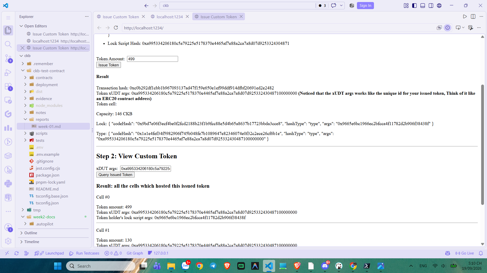
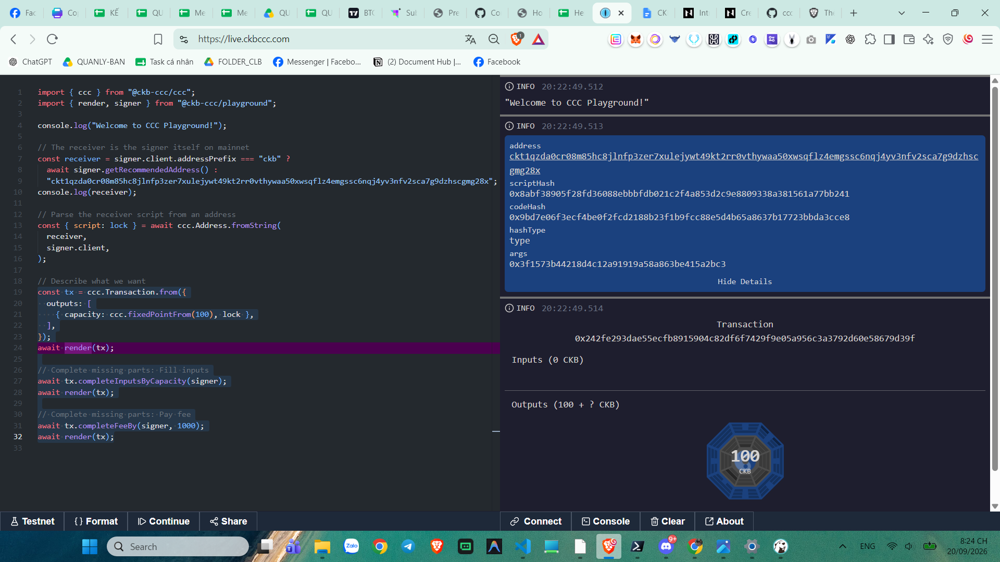
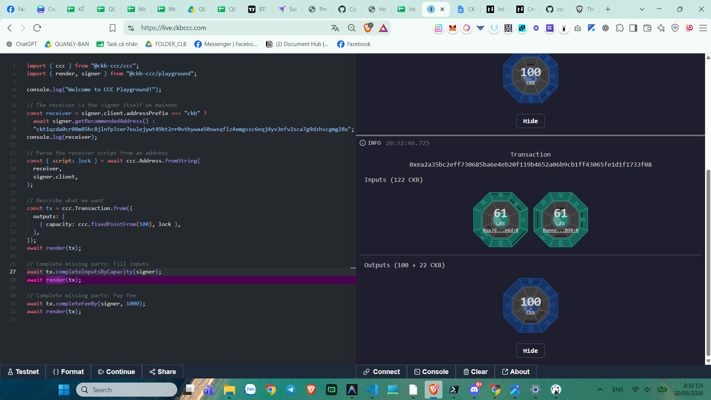

# CKBuilder Weekly Report — Week 2

**Author:** Tuan Ngo<br>
**Reporting period:** 19–20 September 2026<br>
**Status:** Completed<br>
**Scope:** xUDT issuance and transfer, Cell-based token balances, capacity validation, JSON-RPC verification, and CCC transaction composition

## Overview

This week I continued the local CKB Devnet work with the xUDT example and CCC Playground. I issued and queried a custom token, inspected token Cells before and after a transfer, and recorded a failed transfer caused by insufficient CKB capacity. I also used `get_transaction` through the OffCKB RPC proxy to confirm a committed Devnet transaction, then stepped through transaction construction in CCC Playground.

The exercises reinforced that an xUDT balance is not an in-place account value. Token amounts are held in the data of Cells with the same xUDT Type Script. A transfer consumes token Cells and creates recipient and change Cells whose token amounts preserve the total supply.

## Learning completed

### Custom token issuance

I issued a custom xUDT token from the local example. The issue result returned a transaction hash, the xUDT args identifying the token type, and the token Cell scripts.

**Issue transaction hash:** `0xc0b292df1cbb1b967093137ad47f159e650e1ef99ddf914dfbf20691ed2e2482`

**xUDT args:** `0xa995334206180c5a79225e5178370e4465af7e88a2ca7a8d07d925332430487100000000`

The issued Cell shown in the result had **499 tokens** and **146 CKB** capacity. The capacity reserves blockchain space for the Cell; it is separate from the xUDT amount stored in the Cell data.



*Figure 1. Custom xUDT issue result, including the transaction hash, token args, capacity, lock script, and Type Script.*

### Querying token Cells and transferring tokens

The token query showed two Cells with the same xUDT args and amounts of **499** and **130**, for a total of **629 tokens**. A later query showed token Cells of **150** and **479**. The total remained **629**, demonstrating the Cell-based transfer and change model:

```text
499 + 130 = 629
150 + 479 = 629
```

The recipient Cell carried 150 tokens and the sender-side change Cell carried 479 tokens. The xUDT Type Script remained the same, while the lock scripts represented ownership of the resulting Cells.

### Capacity validation

I also attempted another token transfer and received:

```text
Error: Insufficient coin, need 21 extra coin
```

This is a capacity validation result. It means the available CKB capacity could not fund the required output Cells and transaction fee. It did not change the existing token Cells, illustrating that a transaction is not partially applied when construction fails.

The screenshots containing the query and rejection include a private-key field from the local development dApp, so they are deliberately excluded from this repository.

### JSON-RPC verification

I queried a local Devnet transaction through the OffCKB RPC proxy with `get_transaction`. The response returned:

```json
{
  "status": "committed"
}
```

This confirmed the RPC verification workflow independently of the dApp interface. The response also exposed transaction outputs for direct Cell inspection.


*Figure 2. A Devnet `get_transaction` response reporting `committed` and returning transaction output data.*

### CCC Playground transaction composition

I used CCC Playground on Testnet to inspect how a CKB transaction is assembled in stages.

First, I declared a 100 CKB output. At this point the transaction had no inputs because it only described the desired output:

```typescript
const tx = ccc.Transaction.from({
  outputs: [{ capacity: ccc.fixedPointFrom(100), lock }],
});
await render(tx);
```



*Figure 3. CCC Playground transaction after declaring a 100 CKB output, before selecting input Cells.*

Next, I ran:

```typescript
await tx.completeInputsByCapacity(signer);
await render(tx);
```

CCC selected two input Cells totaling 122 CKB and produced outputs totaling 122 CKB: the intended 100 CKB output and 22 CKB of change before final fee completion.



*Figure 4. CCC Playground after input completion, showing 122 CKB of inputs and a 100 CKB output plus 22 CKB change.*

## What I learned

- xUDT identifies a token type through its Type Script and args; token amount is held in Cell data.
- A token transfer consumes existing token Cells and creates recipient and change Cells while preserving the total token amount.
- CKB capacity and xUDT amount are independent. Token Cells still require enough CKB capacity to exist on chain.
- A failed capacity check prevents transaction construction before state changes are submitted.
- `get_transaction` provides independent verification of transaction status and output structure.
- CCC builds a transaction incrementally: declare outputs, collect inputs, then calculate the final fee and change.

## Evidence

See the [Week 2 evidence index](../evidence/week-02/README.md) for the committed screenshots and transaction identifiers.
