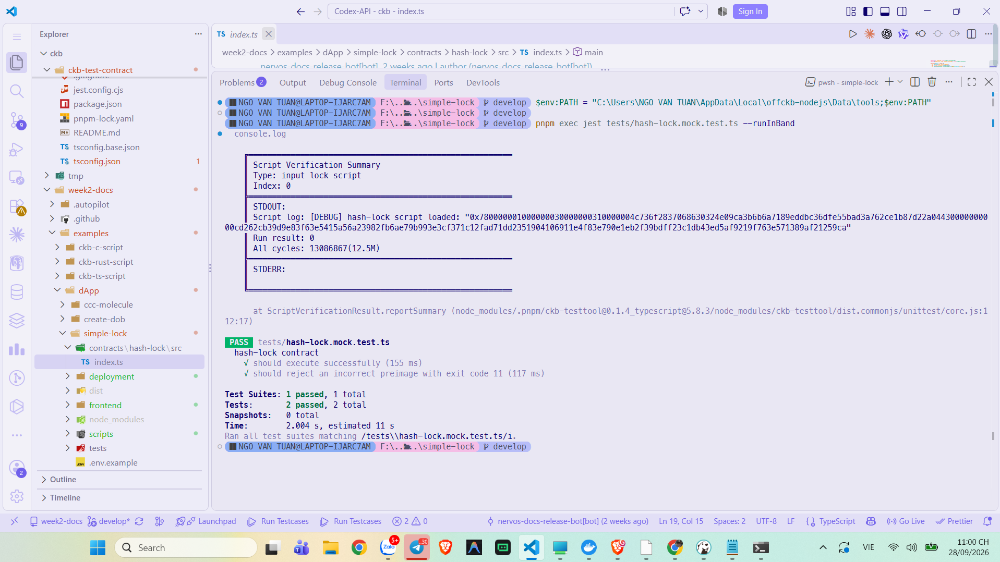
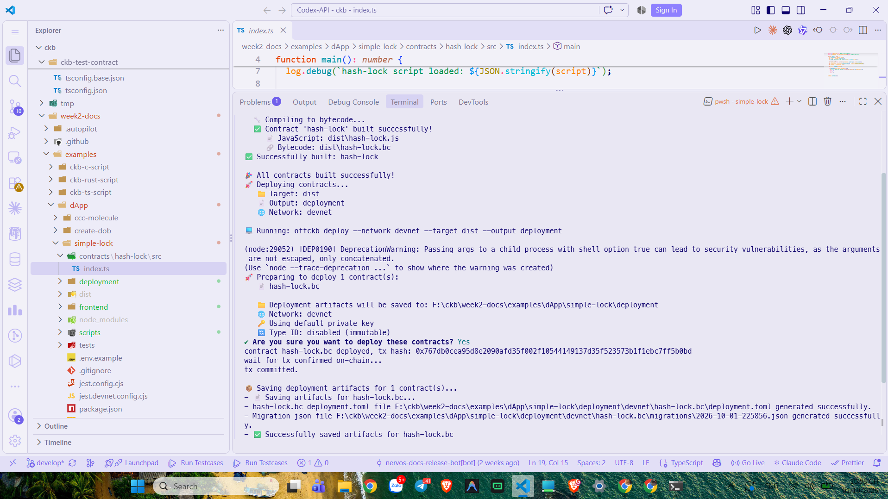
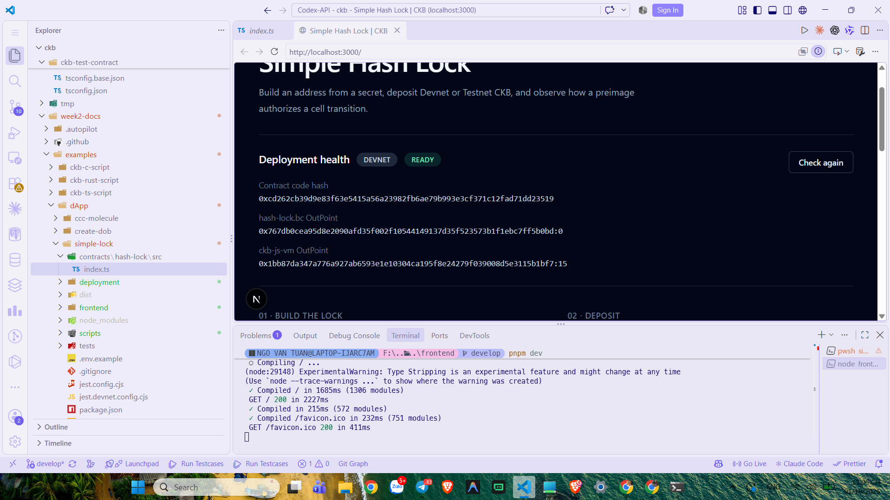
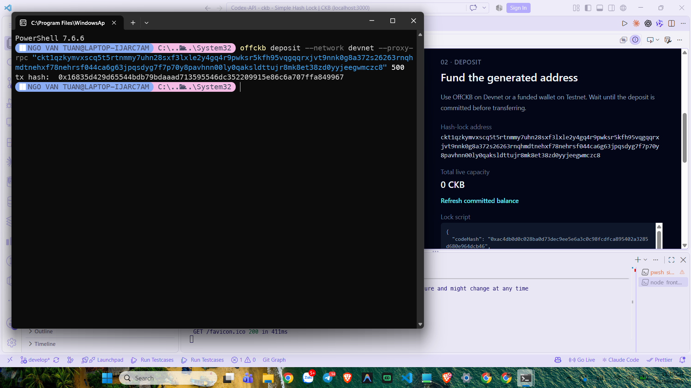
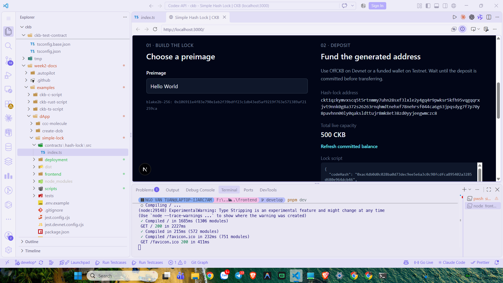
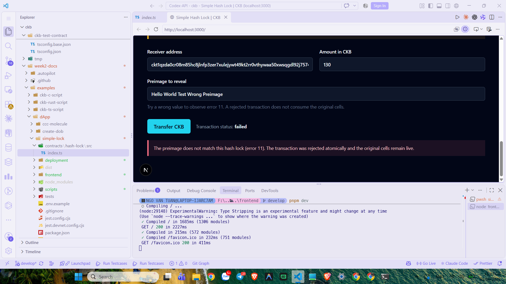
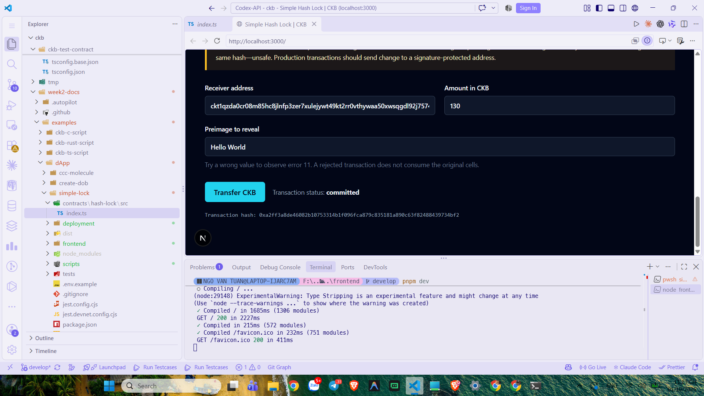
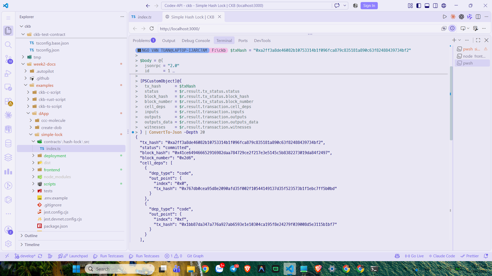

# CKBuilder Weekly Report — Week 3

**Author:** Tuan Ngo<br>
**Reporting period:** 28 September–1 October 2026<br>
**Status:** Completed<br>
**Scope:** JavaScript hash-lock Script, mock verification, Devnet deployment,
hash-lock funding, wrong-preimage rejection, successful unlock, and JSON-RPC
verification

## Overview

This week I built and exercised the Simple Hash Lock example. The contract
derives a lock from a preimage hash and allows an input Cell to be spent only
when the transaction reveals a preimage whose Blake2b-256 hash matches the
stored hash. The workflow was verified locally with Jest and then repeated on
the local Devnet through the frontend.

The important distinction is between the two frontend preimage fields. The
top-level **Preimage** determines the hash-lock address. **Preimage to reveal**
is placed in the transaction witness when the Cell is spent. The address was
kept at `Hello World` while the reveal value was changed to test both failure
and success.

## Contract verification

The mock test suite passed both cases:

```text
Test Suites: 1 passed, 1 total
Tests:       2 passed, 2 total
```

The successful case accepted the correct preimage. The negative case rejected
the incorrect preimage with exit code 11. The exit code is produced by the
contract when the calculated hash does not equal the hash stored in the lock
arguments.



*Figure 1. Jest and ckb-testtool verification: correct preimage succeeds and
incorrect preimage returns exit code 11.*

## Build and Devnet deployment

The contract compiled to `dist/hash-lock.bc` and was deployed successfully.
The deployment transaction was:

```text
0x767db0cea95d8e2090afd35f002f10544149137d35f523573b1f1ebc7ff5b0bd
```

The contract code hash was:

```text
0xcd262cb39d9e83f63e5415a56a23982fb6ae79b993e3cf371c12fad71dd23519
```

The deployed contract OutPoint is the transaction above at index `0`. The
frontend initially referenced an old OutPoint, so its deployment artifact was
updated to the current Devnet deployment. The health check then reported
`READY`, confirming that both the contract Cell and the `ckb-js-vm` dependency
were live.



*Figure 2. Contract build and Devnet deployment completed successfully.*



*Figure 3. Frontend deployment health reports `DEVNET READY` and shows the
current contract and `ckb-js-vm` OutPoints.*

## Funding the hash-lock Cell

With the top-level preimage set to `Hello World`, the frontend generated a
hash-lock address. I deposited 500 CKB to that address. The deposit
transaction was:

```text
0x16835d429d65544bdb79bdaaad713595546dc352209915e86c6a707ffa849967
```

After the deposit was committed, the frontend refresh showed a live capacity
of 500 CKB.



*Figure 4. OffCKB returned the Devnet deposit transaction hash.*



*Figure 5. The generated hash-lock address has 500 CKB of committed live
capacity.*

## Wrong and correct preimages

First, I attempted a 130 CKB transfer with an intentionally incorrect reveal
value. The frontend reported:

```text
Transaction status: failed
The preimage does not match this hash lock (error 11).
```

The rejected transaction did not consume the original Cell, so the same
funding remained available for the valid attempt.



*Figure 6. A wrong witness preimage is rejected with error 11.*

Next, I revealed the correct preimage, `Hello World`, and repeated the 130 CKB
transfer. The transaction reached `committed` status with hash:

```text
0xa2ff3a8de46082b10753314b1f096fca879c835181a890c63f82488439734bf2
```



*Figure 7. The valid preimage authorizes the transfer and the transaction is
committed.*

## JSON-RPC verification

I queried the successful transaction with `get_transaction` through the local
Devnet RPC. The response reported:

```text
status: committed
block_number: 0x2d6
inputs: 1
outputs: 2
witnesses: 1
```

The transaction included the deployed hash-lock contract as a code cell
dependency and the `ckb-js-vm` dependency. Its one input was consumed to create
two outputs: the receiver output and the remaining change output, less the
transaction fee. The witness carried the revealed preimage required by the
hash-lock Script.



*Figure 8. `get_transaction` independently confirms the committed transaction
and exposes its cell dependencies, inputs, outputs, and witness.*

## What I learned

- A preimage is the original secret; its hash is what the lock commits to.
- The lock Script validates the witness at spend time; the contract does not
  invent an output or calculate a missing receiver amount.
- Script arguments identify the expected hash, while the witness supplies the
  candidate preimage.
- A wrong preimage fails with exit code 11 before the input Cell is consumed.
- CKB capacity pays for the Cell's occupied storage and transaction fee; it is
  separate from the hash-lock authorization.
- A successful spend consumes the input Cell and creates receiver and change
  outputs.
- The revealed preimage makes change returned to the same hash-lock unsafe for
  production use; production change should go to a signature-protected lock.

## Evidence

See the [Week 3 evidence index](../evidence/week-03/README.md) for all eight
screenshots and transaction identifiers.
