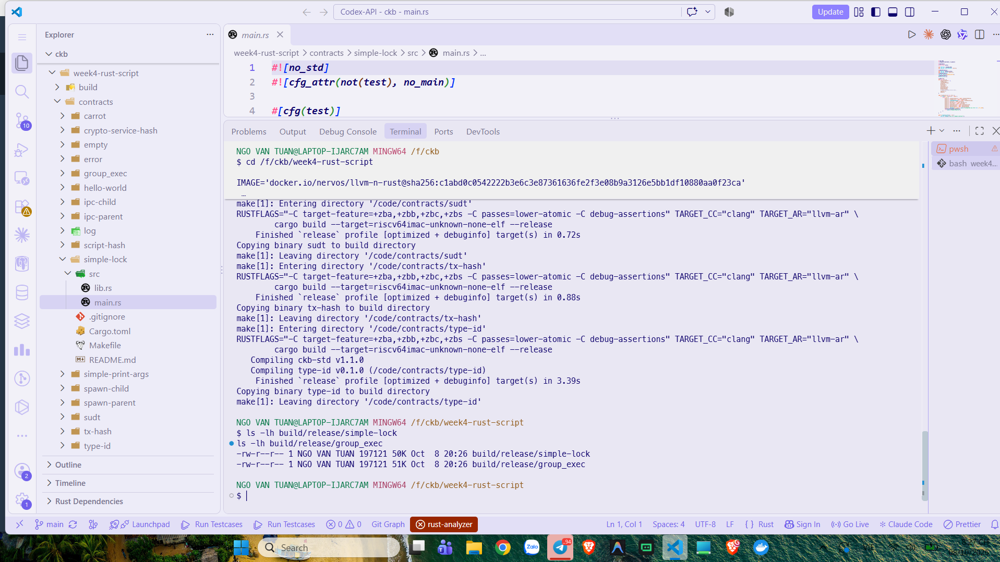
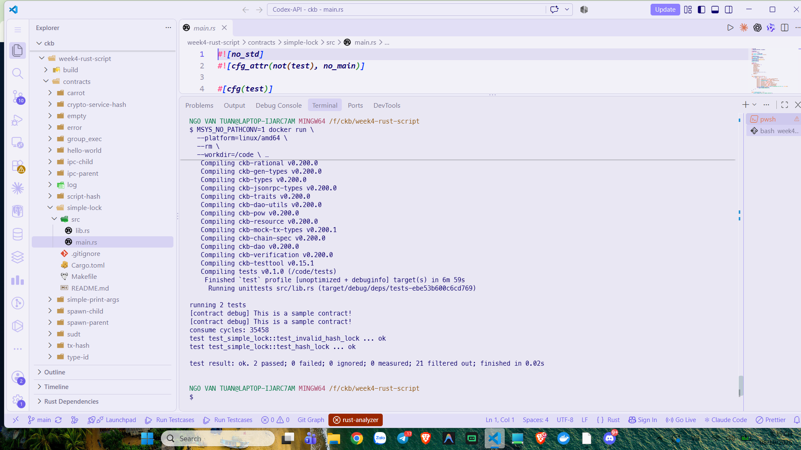
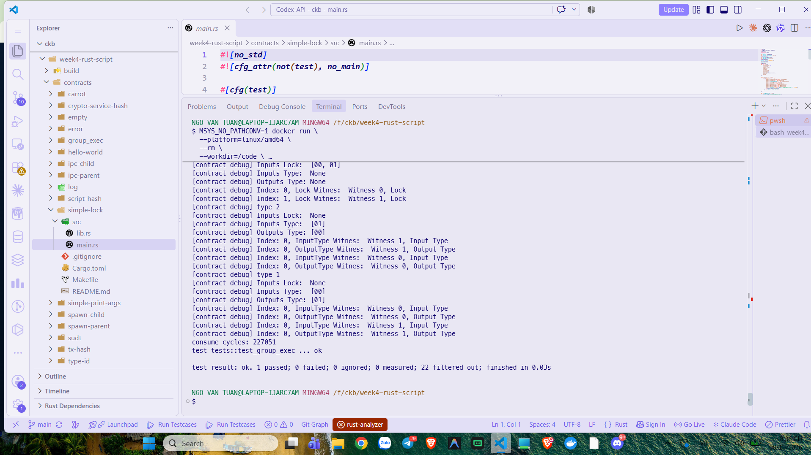
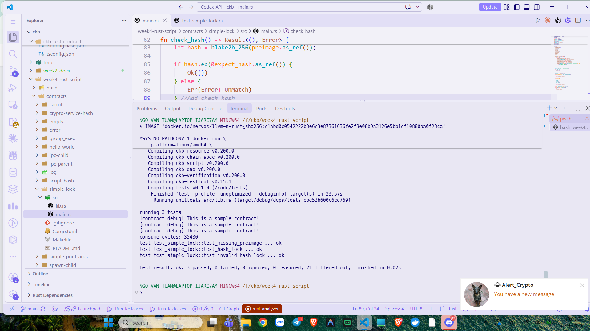

# CKBuilder Weekly Report — Week 4

**Author:** Tuan Ngo<br>
**Reporting date:** 8 October 2026<br>
**Status:** Completed<br>
**Scope:** Rust Simple Lock, CKB-VM execution, witnesses, script groups,
CellDeps, and targeted negative/positive tests

## Overview

This week I moved from the JavaScript hash-lock dApp to the Rust Simple Lock
implementation in the CKB script examples. The contract was built with the
handbook's Docker toolchain and executed locally through `ckb-testtool` and
CKB-VM. I did not deploy anything to Devnet.

The core execution path is:

```text
script.args -> expected 32-byte hash
witness.lock -> supplied preimage
blake2b-256(preimage) -> compare with args
match -> 0
mismatch -> 11
missing/invalid input -> 10
```

## Build

The Docker-based Rust build produced the relevant binaries:

```text
build/release/simple-lock
build/release/group_exec
```



*Figure 1. The handbook build produced the Simple Lock and Script Group
artifacts used by the targeted tests.*

## Simple Lock baseline

The original Rust tests cover the two basic branches:

- `test_hash_lock`: a correct preimage makes the transaction pass;
- `test_invalid_hash_lock`: a wrong preimage produces Script error 11.

Both tests passed:

```text
test result: ok. 2 passed; 0 failed
```



*Figure 2. The original correct-preimage and invalid-preimage tests pass in
CKB-VM.*

## Script groups

The `group_exec` example was used to inspect how CKB groups inputs and outputs
that use the same Script. Its debug output shows lock and type groups and the
witness values read through `GroupInput` and `GroupOutput`.

```text
test tests::test_group_exec ... ok
test result: ok. 1 passed; 0 failed
```



*Figure 3. The Script Group test prints grouped lock/type witness data and
passes under CKB-VM.*

## Validation improvement

I added explicit validation to the Simple Lock path:

- Script arguments must contain a 32-byte hash;
- `WitnessArgs.lock` must exist and must not be empty;
- a present but incorrect preimage remains error 11.

The resulting targeted suite contains three cases:

```text
test_missing_preimage ... ok
test_hash_lock ... ok
test_invalid_hash_lock ... ok

test result: ok. 3 passed; 0 failed
```



*Figure 4. The updated Simple Lock suite passes the correct, incorrect, and
missing-preimage cases.*

## What I learned

- A witness is runtime transaction data; it is not part of the lock Script's
  fixed arguments.
- `script.args` configures the Script instance, while `WitnessArgs.lock`
  supplies the candidate preimage.
- `Source::GroupInput` reads data relative to the current Script group rather
  than treating every transaction input as the same group.
- CellDeps provide executable Script code without being consumed as inputs.
- CKB-VM executes the RISC-V binary and exposes the Script's return code to the
  transaction verifier.
- A rejected Script does not consume the input Cell in the mock transaction.

## Scope note

I did not use the complete workspace test suite as the Week 4 acceptance
command. That suite includes many unrelated handbook examples and requires
their separate binaries. The scoped Simple Lock and Script Group tests above
are the evidence for this week's objective.
